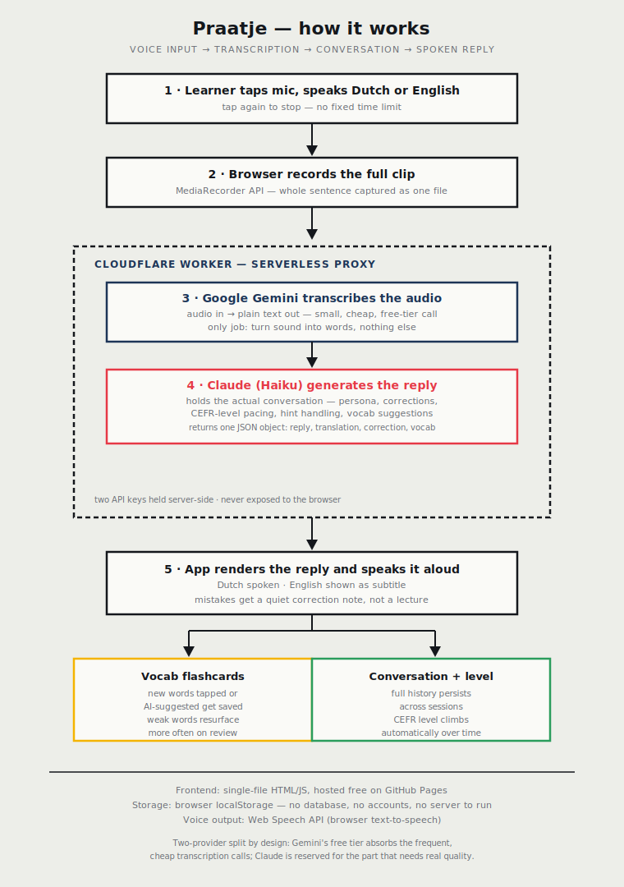

# Praatje

**A voice-first Dutch conversation partner, built for one real person.**

Praatje ("a little chat" in Dutch) is a browser-based app that lets a learner practice *speaking* Dutch out loud with an AI conversation partner named Sanne, instead of tapping through flashcards. Talk, get a spoken reply back in Dutch with an English subtitle, get corrected gently when something's off, and build a vocabulary deck automatically as you go.

**Live app:** [https://anarat2022.github.io/Praatje/]

---

## Why this exists

Most language apps teach reading and tapping. Almost none make you actually talk, because talking is the part people are scared of. Praatje is built around one idea: make speaking feel like chatting with a patient friend, not taking a test.

It was built for a specific person — my sister, learning Dutch — which shaped a lot of the design decisions below. Every feature exists because it solved a real problem she hit while using it.

## What it does

- **Real spoken conversation**, not scripted phrases — talk about whatever comes up, Sanne responds and keeps the conversation going
- **Adaptive difficulty** — the app tracks how the conversation is going and gradually shifts from mostly-English to mostly-Dutch, based on a CEFR-style level (A2 → B2), without the learner manually picking a difficulty every time
- **In-flow correction** — mistakes get folded into Sanne's next reply naturally, the way a friend repeats something back correctly, plus a quiet written note — never a red-pen lecture
- **Two kinds of hints** — "I don't know what to say" (topic help) vs. "I don't know how to say it" (grammar help), because those are genuinely different problems
- **Vocabulary building** — Sanne flags useful words from her own replies as tappable chips, and any word in the conversation (hers or the learner's) can be tapped to save it
- **Flashcard review** — flip cards, mark "got it" / "still learning," weak words resurface more often (lightweight spaced repetition)
- **Persistent conversation** — closing the tab and coming back later picks up right where it left off
- **Zero accounts, zero database** — everything lives in the browser

## Architecture



The short version: the learner's voice never gets sent anywhere in real time. The whole clip is recorded first, then handed to a small Cloudflare Worker that does two things in sequence — asks Gemini to transcribe it (a cheap, fast, free-tier call), then hands that transcript plus the conversation history to Claude, which actually holds the conversation and returns a single structured reply (Dutch text, English translation, an optional correction, and 0–2 vocab suggestions).

### Why record-then-transcribe instead of live dictation

The first version used the browser's built-in live speech recognition (`webkitSpeechRecognition`). It worked, but Chrome's live recognizer would intermittently cut off longer sentences mid-way — a real, recurring bug, not a one-off. Recording the full clip and transcribing it afterward removes that failure mode entirely: there's no live streaming session to hiccup, just one file sent once.

### Why two AI providers instead of one

Early versions ran everything through a single model. Two problems showed up under real testing volume:

- Sending full audio through a single multimodal call on every turn burns through free-tier quota fast
- The two jobs — "transcribe this audio" and "hold an engaging, in-character conversation" — have very different quality bars

Splitting them fixed both: Gemini's free tier absorbs the frequent, low-stakes transcription calls, and Claude (paid, but genuinely cheap in practice) is reserved for the part where response quality actually matters. Real-world cost for daily use lands in fractions of a cent.

## Tech stack

| Layer | Choice |
|---|---|
| Frontend | Vanilla HTML/CSS/JS, single file, no build step |
| Hosting | GitHub Pages (free, static) |
| Backend | Cloudflare Worker (serverless, no server to maintain) |
| Transcription | Google Gemini API (`gemini-flash-latest`) |
| Conversation | Anthropic Claude API (`claude-haiku-4-5`) |
| Voice output | Web Speech API (browser-native text-to-speech) |
| Persistence | `localStorage` — conversation history, level, vocab deck |

## Project structure

```
praatje.html          — the entire app: UI, state, API calls
praatje-worker.js      — Cloudflare Worker: proxies Gemini + Claude,
                         keeps both API keys server-side
architecture.svg        — the diagram above
```

## Running your own copy

1. **Get API keys** — an Anthropic API key ([console.anthropic.com](https://console.anthropic.com)) and a Google Gemini API key ([Google AI Studio](https://ai.google.dev), on a project with no billing attached, to stay on the free tier)
2. **Deploy the Worker** — create a Cloudflare Worker, paste in `praatje-worker.js`, add `ANTHROPIC_API_KEY` and `GEMINI_API_KEY` as encrypted secrets
3. **Point the app at it** — open `praatje.html`, set `WORKER_URL` near the top of the script to your deployed Worker's URL
4. **Host it** — push `praatje.html` (renamed to `index.html`) to a GitHub repo, enable GitHub Pages in the repo settings

No database, no signup flow, no server to keep running.

## What I'd build next

- Swap the browser voice for a proper TTS provider for more natural pronunciation
- A lightweight review-streak view so progress feels visible over weeks, not just sessions
- Export the vocab deck to a shareable list

---

Built to solve one real problem for one real person, not as a generic language-app clone.
